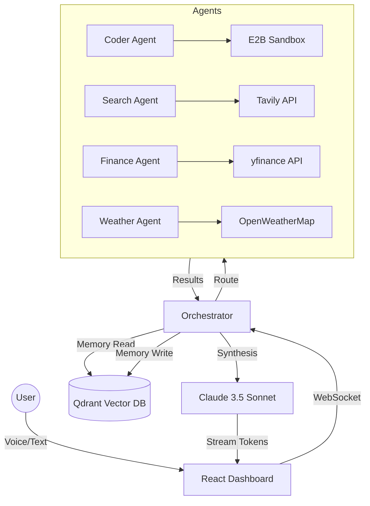

# JARVIS — Advanced Intelligence System


**JARVIS** (Just A Rather Very Intelligent System) is a high-performance, voice-driven AI virtual assistant. Designed with a professional, futuristic aesthetic and a multi-agent backend, JARVIS moves beyond simple chatbots to provide a truly autonomous experience—capable of real-time web research, code execution, system control, and proactive task management.

---

## 🌟 Project Uniqueness (Interview Highlights)

JARVIS stands out as a sophisticated engineering project through several key architectural choices:

- **Orchestrated Multi-Agent Logic**: Unlike linear LLM flows, JARVIS uses a central Orchestrator to route tasks to specialized agents (Weather, Finance, Coder, etc.). This ensures each task is handled by the most optimized logic and toolset.
- **Continuous Voice-First UX**: Implements a dedicated "Wake Word" detection system ("Hey Jarvis"), a VAD (Voice Activity Detection) controller for seamless commands, and low-latency audio streaming.
- **Persistent Memory Core**: Bridges short-term conversation context with long-term semantic memory using **Qdrant Vector DB** and **mem0**, allowing the AI to learn user preferences over time.
- **Professional Neural UI**: A high-fidelity "Cyberpunk/Professional" dashboard built with Framer Motion and custom CSS, providing real-time telemetry of agent actions and system health.

---

## 🎙️ Hands-Free Voice Control

JARVIS is designed for a completely hands-free interaction loop:

1. **Wake Word Detection**: Continually listens for "Hey Jarvis" using the browser's Web Speech API.
2. **Dynamic Command Recording**: Once triggered, a high-quality MediaRecorder captures the user's intent. It uses intelligent silencing detection to know when you've finished speaking.
3. **OpenAI Whisper STT**: Transcribes commands with 99% accuracy, even in noisy environments.
4. **OpenAI TTS Synthesis**: Delivers natural-sounding responses, completing the human-like interaction cycle.
5. **Auto-Resume**: Automatically resumes wake-word listening after responding, enabling a multi-turn voice conversation without manual clicks.

---

## 🧠 The Agent Network

JARVIS delegates complexity to a network of specialized agents, each equipped with its own toolset:

| Agent | Capability | Tools Used |
| :--- | :--- | :--- |
| **Search Agent** | Advanced, cited web research | Tavily, Playwright |
| **Coder Agent** | Writes and executes Python code in real-time | E2B Code Interpreter |
| **Finance Agent** | Stock quotes, crypto trends, and market analysis | yfinance, CoinGecko |
| **Weather Agent** | Precise current conditions and 5-day forecasts | OpenWeatherMap |
| **Email Agent** | Professional email drafting and (OAuth required) Gmail management | Gmail API |
| **System Agent** | Controls the browser/OS (Open tabs, switch panels) | System Navigation Core |
| **News Agent** | Fetches latest global headlines | NewsAPI |

---

## 🏗️ System Architecture



---

## 🛠️ Technology Stack

| Layer | Technologies |
| :--- | :--- |
| **Frontend** | React 18, TypeScript, Tailwind CSS, Framer Motion, Lucide Icons |
| **Backend** | FastAPI, LangGraph, LangChain, Python 3.10+ |
| **Intelligence** | Anthropic Claude 3.5 Sonnet (Core), Groq Llama 3 (Classification) |
| **Voice** | OpenAI Whisper (STT) & OpenAI TTS-1 |
| **Storage** | Qdrant (Vector), PostgreSQL (Relational), Redis (Cache), mem0ai |

---

## 🚀 Getting Started

### 1. Prerequisites
- Python 3.10+, Node.js 18+, Docker.
- API Keys: Anthropic, Groq, OpenAI, Tavily, E2B, OpenWeatherMap.

### 2. Quick Setup
```bash
# Clone and setup Backend
cd backend
python -m venv venv
pip install -r requirements.txt
cp .env.example .env # Add your keys here
uvicorn app.main:app --reload

# Setup Frontend
cd ../jarvis-frontend
npm install
npm run dev
```

---

## 👥 Contributors

- **Bhargavi Battula**
- **Satya Ruchitha** 

---

## 📜 License
This project is licensed under the MIT License.

---
*Developed with precision to push the boundaries of Agentic AI and Human-Computer Interaction.*
